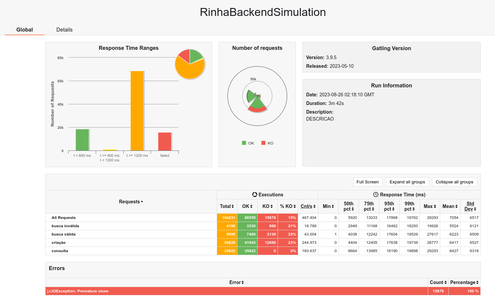
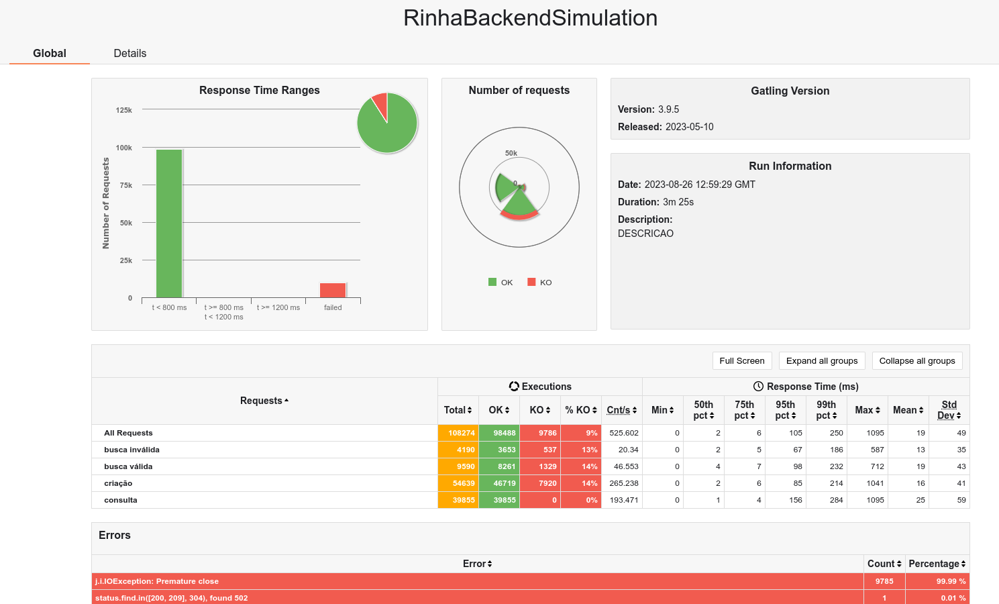
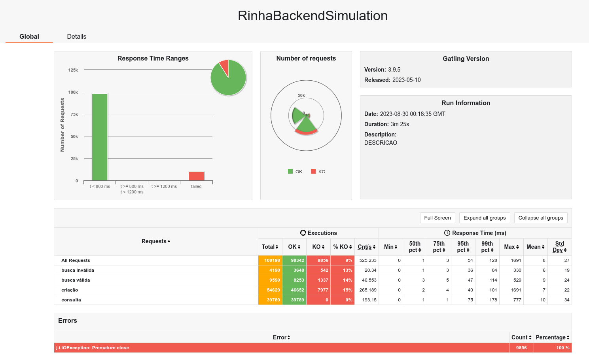

# rinha de backend

Soluções para o desafio da rinha de backend https://github.com/zanfranceschi/rinha-de-backend-2023-q3.

## Stress test

Script gatling do [zanfranceschi/rinha-de-backend-2023-q3](https://github.com/zanfranceschi/rinha-de-backend-2023-q3/tree/main/stress-test), com os apontamentos locais.

### Rodar

```shell
cd stress-test
./run-test.sh
```

## Soluções

- [Spring-boot](rinha-spring)

- [Vertx](rinha-vertx)

- [Spring-boot-virtual-threads](rinha-spring-virtual-threads)

## Resultados

Rodando no seguinte hardware:

```shell
sudo lshw -short
H/W path          Device          Class          Description
============================================================
/0/0                              memory         64KiB BIOS
/0/26                             memory         16GiB System Memory
/0/26/0                           memory         8GiB SODIMM DDR4 Synchronous 3200 MHz (0,3 ns)
/0/26/1                           memory         8GiB SODIMM DDR4 Synchronous 3200 MHz (0,3 ns)
/0/32                             memory         288KiB L1 cache
/0/33                             memory         192KiB L1 cache
/0/34                             memory         7680KiB L2 cache
/0/35                             memory         24MiB L3 cache
/0/36                             memory         256KiB L1 cache
/0/37                             memory         512KiB L1 cache
/0/38                             memory         4MiB L2 cache
/0/39                             memory         24MiB L3 cache
/0/3a                             processor      12th Gen Intel(R) Core(TM) i7-12700H
```

### solução [Spring-boot](rinha-spring)

- 1 - bateria de testes, a melhor execução: 35822 pessoas inseridas

    

- 2 - bateria de testes, ajuste na distribuição de CPU entre os container, 39855 pessoas inseridas

    

- 3 - bateria de testes, uso de UUID v7 para facilitar a indexação dos ids no banco + utilização do undertow ao invés do tomcat: 39924 pessoas inseridas

    

- 4 - bateria de testes: jvm x native

    - 4.1 - jvm, rodar com profile jvm `docker compose --profile jvm up -d`: 39793 pessoas inseridas
    
        
    
        ```shell
        docker stats
        CONTAINER ID   NAME                   CPU %     MEM USAGE / LIMIT   MEM %     NET I/O           BLOCK I/O        PIDS
        d67183e6b442   rinha-spring-nginx-1   8.90%     96.84MiB / 512MiB   18.91%    87.7MB / 85.2MB   0B / 12.3kB      21
        f69d709e2b20   rinha-spring-api2-1    14.08%    198.2MiB / 512MiB   38.72%    29.8MB / 32.8MB   504kB / 594kB    35
        677b41410a78   rinha-spring-api1-1    14.90%    186.4MiB / 512MiB   36.41%    29.7MB / 32.4MB   0B / 524kB       35
        4ef7064eea1f   rinha-spring-db-1      38.46%    130.6MiB / 1.5GiB   8.50%     28.9MB / 24.1MB   12.3kB / 465MB   38  
        ```
    
    - 4.2 - native, rodar com profile native `docker compose --profile native up -d`: 39826 pessoas inseridas

        
    
        ```shell
        docker stats
        CONTAINER ID   NAME                          CPU %     MEM USAGE / LIMIT   MEM %     NET I/O           BLOCK I/O     PIDS
        687fdcd01a57   rinha-spring-nginx-native-1   10.32%    96.6MiB / 512MiB    18.87%    87.6MB / 84.9MB   0B / 12.3kB   21
        79aafaa6b63b   rinha-spring-api-native1-1    29.98%    135MiB / 512MiB     26.37%    29.6MB / 31.9MB   55.8MB / 0B   24
        b85c3011b4ad   rinha-spring-api-native2-1    29.67%    114.3MiB / 512MiB   22.32%    29.8MB / 32MB     28.5MB / 0B   24
        035a1d888203   rinha-spring-db-1             54.48%    129.7MiB / 1.5GiB   8.45%     28MB / 24.2MB     0B / 484MB    38
        ```

### solução [Vertx](rinha-vertx)

- 1 - bateria de testes: projeto inicial: 39762 pessoas inseridas

    

    ```shell
    docker stats
    CONTAINER ID   NAME                  CPU %     MEM USAGE / LIMIT   MEM %     NET I/O           BLOCK I/O        PIDS
    c25c3d66d2b7   rinha-vertx-nginx-1   9.29%     95.8MiB / 512MiB    18.71%    72.8MB / 76.7MB   815kB / 12.3kB   21
    0dde7408a51b   rinha-vertx-api2-1    5.71%     109.1MiB / 512MiB   21.31%    34.6MB / 27.1MB   2.42MB / 471kB   18
    ffee782833f7   rinha-vertx-api1-1    5.14%     104.6MiB / 512MiB   20.44%    34.4MB / 26.9MB   504kB / 524kB    18
    7ef90b5a7234   rinha-vertx-db-1      43.97%    80.88MiB / 1.5GiB   5.27%     29.2MB / 36.4MB   569kB / 489MB    14
    ```

### solução [Spring-boot-virtual-threads](rinha-spring-virtual-threads)

- 1 - bateria de testes inicial: 39789 pessoas inseridas

    

    ```shell
    docker stats
    CONTAINER ID   NAME                                   CPU %     MEM USAGE / LIMIT     MEM %     NET I/O           BLOCK I/O         PIDS
    c78a5b11eea5   rinha-spring-virtual-threads-nginx-1   10.08%    97.79MiB / 307.2MiB   31.83%    91.8MB / 91.5MB   2.24MB / 12.3kB   21
    69c9404136d0   rinha-spring-virtual-threads-api1-1    18.27%    216.2MiB / 512MiB     42.22%    32.5MB / 34.3MB   14.3MB / 524kB    28
    24c748b95bbe   rinha-spring-virtual-threads-api2-1    16.70%    213.9MiB / 512MiB     41.78%    32.7MB / 34.6MB   705kB / 524kB     28
    a5895a146250   rinha-spring-virtual-threads-db-1      41.27%    161.3MiB / 1.5GiB     10.50%    28.9MB / 27.6MB   4.31MB / 476MB    56
    ```

### soluções enviadas para rinha

- 1 - bateria de testes da solução vitoriosa do [viniciusfonseca](https://github.com/viniciusfonseca/rinha-backend-rust): 40255 - 403 (inseridas na base antes da execução) = 39852 pessoas inseridas
  
    

    ```shell
    http :9999/contagem-pessoas
    HTTP/1.1 200 OK
    Connection: keep-alive
    Content-Length: 3
    Date: Wed, 30 Aug 2023 02:07:54 GMT
    Server: nginx/1.25.2
    
    403
    ```