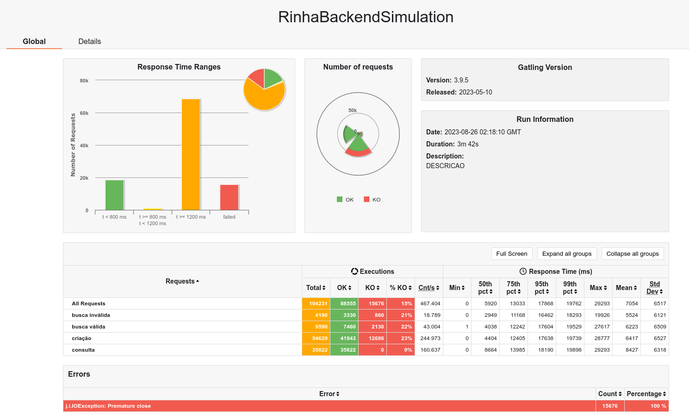
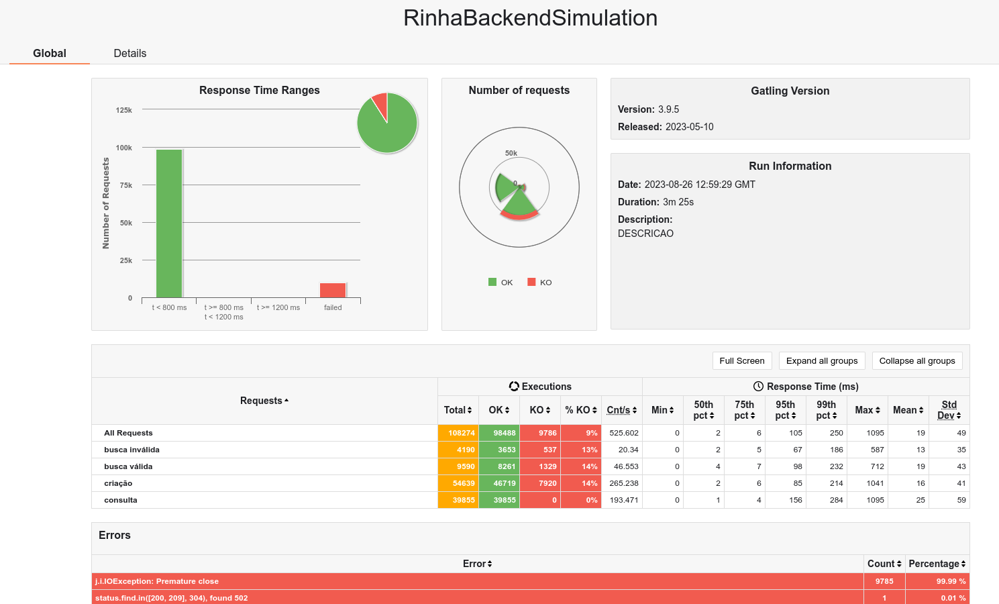
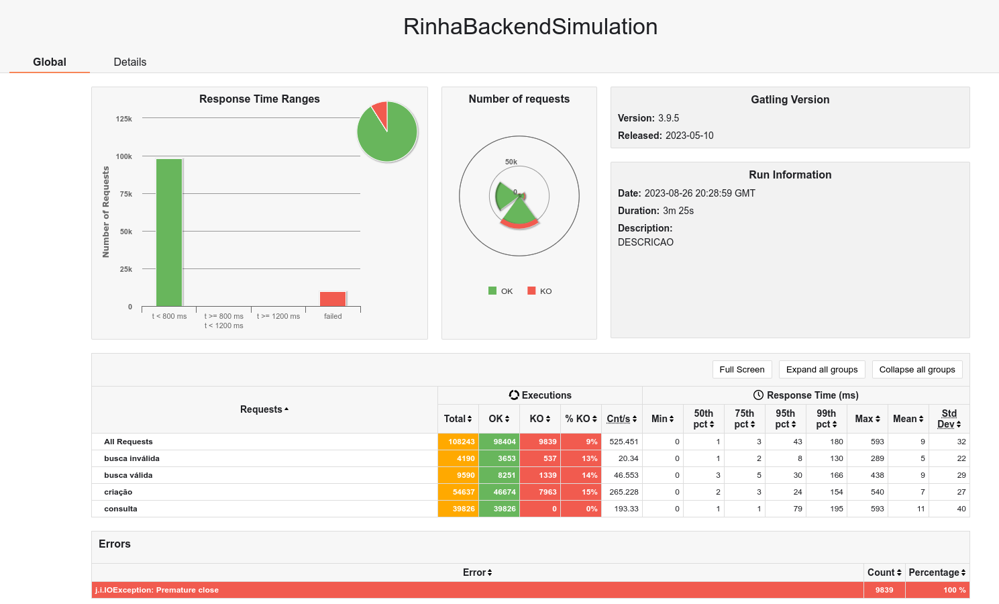

# Rinha backend springão da massa, quem paga as contas 

Projeto para resolver o desafio da rinha de backend https://github.com/zanfranceschi/rinha-de-backend-2023-q3, usando:

- java 17
- spring boot 3.1.3
- postgresql 15.4

## Sobre

- Github: https://github.com/hstreb
- Twitter: https://twitter.com/humbertostreb

## Otimizações

- as configurações do postgresql e nginx inspiradas na solução do [viniciusfonseca/rinha-backend-rust](https://github.com/viniciusfonseca/rinha-backend-rust/)

## construir

- jvm
  ```shell
  ./gradlew build
  docker build -t hstreb/rinha-spring:0.0.1 .
  ```

- native

  - construir o jar

  ```shell
  ./gradlew build
  ```
    
  - rodar o jar com agente

  ```shell
  docker compose up -d
  sleep 5
    
  java -Dspring.aot.enabled=true -agentlib:native-image-agent=config-output-dir=src/main/resources/META-INF/native-image/ -jar build/libs/rinha-spring-0.0.1.jar &
  pid=$!
  ```

  - rodar algumas chamadas

  ```shell
  url_pessoa=$(echo '{"nome":"Teste","apelido":"teste19","nascimento":"2000-01-01","stack":["java","scala"]}' | http --headers :8080/pessoas | awk -F': ' 'tolower($1)=="location" {print $2}')
  curl $url_pessoa
  echo '{"nome":"Teste","apelido":"teste2","nascimento":"2000-01-01","stack":["java","scala"]}' | http :8080/pessoas
  echo '{"nome":"Teste","apelido":"teste","nascimento":"2000-01-01","stack":["java","scala"]}' | http :8080/pessoas
  echo '{"nome":"Teste","apelido":"teste","nascimento":"2000-01-01","stack":["java","scala"]}' | http :8080/pessoas
  echo '{"apelido":"teste1","nascimento":"2000-01-01","stack":["java","scala"]}' | http :8080/pessoas
  echo '{"nome":"Teste1","apelido":"teste1","nascimento":"2000-21-01","stack":["java","scala"]}' | http :8080/pessoas
  http :8080/pessoas
  http :8080/pessoas t==java
  http :8080/contagem-pessoas
  ```
  
  - construir a imagem nativa

  ```shell
  ./gradlew bootBuildImage --imageName=hstreb/rinha-spring:0.0.1-native
  ```

## rodar

```shell
docker compose up -d
```

## Resultados

- 1 - bateria de testes, a melhor execução: 35822 pessoas inseridas

  

- 2 - bateria de testes, ajuste na distribuição de CPU entre os container, 39855 pessoas inseridas

  

- 3 - bateria de testes, uso de UUID v7 para facilitar a indexação dos ids no banco + utilização do undertow ao invés do tomcat: 39924 pessoas inseridas

  

- 4 - bateria de testes: jvm x native

  - 4.1 - jvm, rodar com profile jvm `docker compose --profile jvm up -d`: 39793 pessoas inseridas
  
    
  
    ```shell
    docker stats
    CONTAINER ID   NAME                   CPU %     MEM USAGE / LIMIT   MEM %     NET I/O           BLOCK I/O        PIDS
    d67183e6b442   rinha-spring-nginx-1   8.90%     96.84MiB / 512MiB   18.91%    87.7MB / 85.2MB   0B / 12.3kB      21
    f69d709e2b20   rinha-spring-api2-1    14.08%    198.2MiB / 512MiB   38.72%    29.8MB / 32.8MB   504kB / 594kB    35
    677b41410a78   rinha-spring-api1-1    14.90%    186.4MiB / 512MiB   36.41%    29.7MB / 32.4MB   0B / 524kB       35
    4ef7064eea1f   rinha-spring-db-1      38.46%    130.6MiB / 1.5GiB   8.50%     28.9MB / 24.1MB   12.3kB / 465MB   38  
    ```
  
  - 4.2 - native, rodar com profile native `docker compose --profile native up -d`: 39826 pessoas inseridas

    
  
    ```shell
    docker stats
    CONTAINER ID   NAME                          CPU %     MEM USAGE / LIMIT   MEM %     NET I/O           BLOCK I/O     PIDS
    687fdcd01a57   rinha-spring-nginx-native-1   10.32%    96.6MiB / 512MiB    18.87%    87.6MB / 84.9MB   0B / 12.3kB   21
    79aafaa6b63b   rinha-spring-api-native1-1    29.98%    135MiB / 512MiB     26.37%    29.6MB / 31.9MB   55.8MB / 0B   24
    b85c3011b4ad   rinha-spring-api-native2-1    29.67%    114.3MiB / 512MiB   22.32%    29.8MB / 32MB     28.5MB / 0B   24
    035a1d888203   rinha-spring-db-1             54.48%    129.7MiB / 1.5GiB   8.45%     28MB / 24.2MB     0B / 484MB    38
    ```