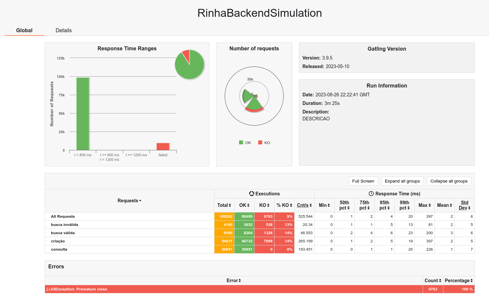

# Rinha backend, usando vertx

Projeto para resolver o desafio da rinha de backend https://github.com/zanfranceschi/rinha-de-backend-2023-q3, usando:

- java 17
- vertx 4.4.5
- postgresql 15.4

## Sobre

- Github: https://github.com/hstreb
- Twitter: https://twitter.com/humbertostreb

## Otimizações

- as configurações do postgresql e nginx inspiradas na solução do [viniciusfonseca/rinha-backend-rust](https://github.com/viniciusfonseca/rinha-backend-rust/)

## construir

- jvm
  ```shell
  ./gradlew build
  docker build -t hstreb/rinha-spring:0.0.1 .
  ```

## Resultados

- 1 - bateria de testes: projeto inicial: 39762 pessoas inseridas

  

  ```shell
  docker stats
  CONTAINER ID   NAME                  CPU %     MEM USAGE / LIMIT   MEM %     NET I/O           BLOCK I/O        PIDS                                                                                        [85/8834]
  c25c3d66d2b7   rinha-vertx-nginx-1   9.29%     95.8MiB / 512MiB    18.71%    72.8MB / 76.7MB   815kB / 12.3kB   21
  0dde7408a51b   rinha-vertx-api2-1    5.71%     109.1MiB / 512MiB   21.31%    34.6MB / 27.1MB   2.42MB / 471kB   18
  ffee782833f7   rinha-vertx-api1-1    5.14%     104.6MiB / 512MiB   20.44%    34.4MB / 26.9MB   504kB / 524kB    18
  7ef90b5a7234   rinha-vertx-db-1      43.97%    80.88MiB / 1.5GiB   5.27%     29.2MB / 36.4MB   569kB / 489MB    14
  ```

